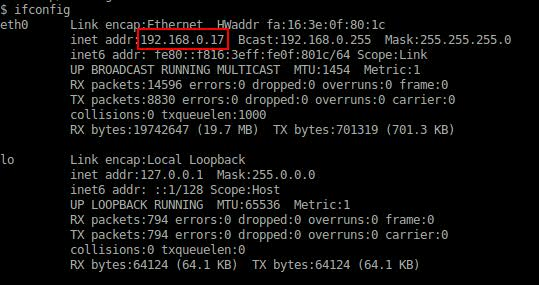
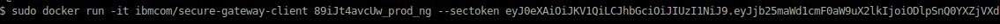
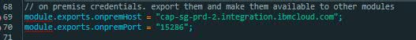

# Workload - Secure Web Data

###Secure Web Data application example implemented in containers


The Secure Web Data application demonstrates
the Bluemix services **Single Sign On**, **Object Storage**, and **Secure Gateway**.

## Introduction

This Secure Web Data sample application has been created so you can deploy it into your personal space
after signing up for Bluemix and the DevOps Services. You will attach the
**Object Storage**, **Single Sign On**, and the **Secure Gateway** services. Once the application is set up, you will be able
to interact with files sitting on either **Object Storage** or an on-prem solution.


## Sign up for and log into Bluemix and DevOps

Sign up for Bluemix at https://console.ng.bluemix.net and DevOps Services at https://hub.jazz.net.
When you sign up, you'll create an IBM ID, create an alias, and register with Bluemix.


## Push to Bluemix Button

Use the **Push to Bluemix** button bellow to fork the code, create the needed Cloud Foundry bridge application, and create / bind needed services to your Bluemix space. 

[](https://bluemix.net/deploy?repository=https://hub.jazz.net/git/cfsworkload/hybrid-data-store-app)
 
Continue to configure single sign on.


### Configure Single Sign On

Select the **Single Sign On** service in your space to take you to the configuration menu.

1. Enter a name for the service and click **Continue**.
2. Select **Cloud Directory** on the left.
3. Create a new user to log in to the application with and click **Save**.
4. Return to your bridge application's dashboard and click **BIND A SERVICE OR API**.
5. From the list of services, select your newly configured **Single Sign On** and click **ADD**.
6. Click **RESTAGE**.

## Set up an on-prem database and connect Secure Gateway

To demonstrate an on-prem solution, you'll create a virtual machine  using MongoDB. You'll then connect it to your application using
the Secure Gateway service. The steps provided here will utilize virtual machines in Bluemix. In your own on-prem location, you'll
want to create your own virtual machine and follow similar steps to set up MongoDB and connect it to your application through **Secure Gateway**.

1. Provision a virtual machine. In the Bluemix Dashboard, click **RUN VIRTUAL MACHINES**.
2. Select **Ubuntu 14.04** from your **Images to launch**.
3. Leave the **Initial instances** at 1 and make sure the **Assign public IP addresses** box is checked.
4. Give your VM group a name and select the desired size.
5. Either import or create a new **Security Key** for accessing the virtual machine.
6. Select **CREATE**. This will take you to your VM group's dashboard.

Now you'll access your virtual machine and configure it to use MongoDB and Docker.

1. To access the
terminal of the VM use ssh and the following command:
  `ssh -i path/<private_key_name> ibmcloud@<externalIP>`

  For information about accessing VMs in Bluemix, see  https://www.ng.bluemix.net/docs/virtualmachines/vm_index.html.
2. Once inside the VM, run the following commands to install MongoDB:
```
sudo apt-get update
sudo ufw disable
sudo apt-get install -y mongodb-server
```
3. Run `ifconfig` to get the local IP assigned to your eth0 adapter.

  

4. Run `sudo vi /etc/mongodb.conf`.
5. Assign the local IP you got above to the `bind_ip` field and un comment the `port` field.
6. Run the following commands:
```
sudo service mongodb stop
sudo service mongodb start
```
You now have an instance of MongoDB running on the default port 27017 inside your virtual machine.
7. Run the following commands to install Docker, which you'll use to connect to your Secure
Gateway:
```
sudo apt-get install -y curl
sudo curl -sSL https://get.docker.com/ | sh
```
You now have Docker running in your virtual machine.

8. Return to your bridge application's **Secure Gateway** to get the information needed to connect.
  1. In the Bluemix Dashboard, select your application.
  2. In the application's dashboard, select **Secure Gateway**.
  3. Click **ADD GATEWAY**.
  4. Name the gateway and click **CONNECT IT**. A `docker run` command will generate.
  5. Copy the `docker run` command.
9. Return to your virtual machine's terminal. Enter `sudo` then paste the `docker run` command from your clipboard.  
For example:

 

  This will connect the gateway to your virtual machine. Once it succeeds, you will see a message saying **The Secure Gateway tunnel is connected**

10. Press enter and a **cli>** will appear
11. In the Secure Gateway window, enter `acl allow :27017`.
12. Return to Bluemix and click **I'M DONE**.
13. Select the gateway you just created and wait for it say **CONNECTED**
14. Enter a **Destination name**.
15. Enter the local IP address you got from the `ipconfig` command inside your VM in the **IP Address** field.
16. Enter **27017** in the **Port** field.
17. Click the **+** (plus icon) to save your destination. A tile will appear below.
18. In the newly created tile, click the **i** (information icon) and you will see the IP port of your gateway to the MongoDB under **Cloud Host: Port**.
19. Copy the IP and port to your clipboard.
19. Return to your forked project in Bluemix DevOps Services and click **EDIT CODE** at top right of the page.
20. In the Node/config.js file, replace the `module.exports.onpremHost` and `module.exports.onpremPort` fields with the gateway credentials to the MongoDB on-prem database.

  
  
21. Select the **File** menu and click **Save**.
22. Click the **GIT** symbol under the pencil to the left
23. In box to the right give a name to your changes and click **commit**
24. In the left select **sync** to push the changes to master 
25. Select the **File** menu and click **Save**.


## Set up a deployment pipeline

You can now configure your application's deployment pipeline. This pipeline will build, deploy, and test that your application
is up and running after deployment. You will first build and deploy the application to Bluemix, which will provide your application's external IP, and then you'll create a test stage.

1. Add a build stage to your pipeline.
	1. On your DevOps Services project page, click **BUILD & DEPLOY** at the top right. This opens your pipeline IDE.
	2. Click **ADD STAGE** and name the stage "Build."
	3. On **INPUT** leave the default settings and click the **JOBS** tab.
	4. Click **ADD JOB** and then select **Build**.
	5. In **Builder Type** select **IBM Container Service**.
	6. Leave the default settings and give your image a name in **Image Name**.
	7. Click **SAVE**.
	
2. Add a deploy stage to your pipeline.
	1. Click **ADD STAGE** and name the new stage "Deploy."
	2. On **INPUT** leave the default settings and click the **JOBS** tab.
	3. Click **ADD JOB** and then select **Deploy**.
	4. In **Deployer Type** select **IBM Containers on Bluemix**.
	5. Name your application in **Name**.
	6. In **Port** enter **9443**.
	7. In **Optional deploy arguments** enter **--bind <your bridge app name>**.
	8. Click **SAVE**.
3. On the pipeline overview page, click the play button on the **Build** stage.

  This will build and deploy the application to a container in your Bluemix space. Monitor the stages by clicking **View logs and history**. At the end of your deploy stage, you will be provided with the IP:PORT of your application in **View logs and history**. Every time the deploy stage runs, it uses the red-black deploy provided by the pipeline and you may receive a new IP:PORT.
  If you receive a new IP:PORT, you need to follow through the steps in **Add callback to Single Sign On**.

  Now we will create a test stage to confirm the application is up and running in future deployments.

4. Add a test stage to your pipeline.
  1. Click **ADD STAGE**.
  2. Provide a name for the stage (Test).
  3. In the **Jobs** tab, click **ADD JOB** and select **Test**.
  4. In the **Test Command** window, add a simple test for your application.  
    * For example: `curl http://<external IP of application>`
  5. Click **SAVE**.
  6. In **BUILD & DEPLOY**, click the play button on the **Test** stage to confirm your application is up and running.

You now need to add the new IP given in **View logs and history** of the deploy stage to Single Sign On callback.

## Add callback to Single Sign On

1. Return to your bridge application's dashboard and select **Single Sign On**.
2. Click **Integrate** in the top right.
3. In the **Return-to URL** field, enter `http://<external IP of application>:<port>/auth/sso/callback`.
4. Click **Save**.


Now your application is ready to be accessed. In a browser window, enter your `<External IP>:9443`.

# What Does the App Do?

Your new Secure Web Data application can upload files from your local system, delete files, and retrieve files from either Object Storage or your on-prem database. Upon first loading the application, there won't be any files listed under **Object Storage**
or **On Premises**. To start uploading files from your local file system, select the **Object Storage** or **On Premises** box at the top of the page and select **Drop files or click here to upload**.

## Verify upload
To inspect on-premises content:
1. From the virtual machine terminal entering the following commands:
  1. Run the Mongo shell.  
  `sudo mongo <internal IP from ifconfig>`
  2. Query the list of collections.  
  `db.getCollectionNames()`
  3. Query files in the collection "fs.files," which shows files uploaded to the on-prem location.  
  `db.[collection name].find()`  

To inspect Object Storage content:
1. From the Application's Dashboard, select Object Storage.

